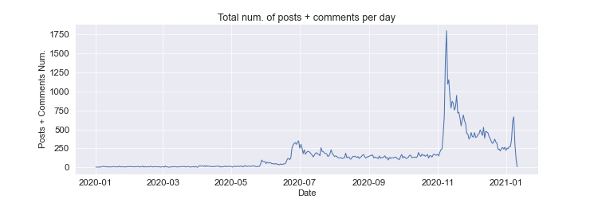

# Milestone 1

## Dataset

Our work focuses on a dataset extracted from the now defunct social network Parler. It was a platform similar to Twitter, with users being able to create posts. Other users could interact with them through comments, upvotes and downvotes. It also used hashtags. Our dataset can be split into 3 main parts.

The first part contains 183 million posts and comments made to Parler between August 2018 and January 2021. For each one, we have information such as a timestamp, the number of upvotes and downvotes, and the hashtags it contains.

The second part provides information about Parler users, such as their biography, when their account was created, their number of followers, the number of people they follow and the number of posts and comments they made. These first two parts are taken from [Zenodo](https://zenodo.org/record/4442460#.YIGHfC0Rpqt), and are explained in greater detail in [this paper](https://arxiv.org/abs/2101.03820).

The last dataset we use contains metadata taken from videos posted to Parler. It was compiled and [posted to GitHub](https://gist.github.com/kylemcdonald/8fdabd6526924012c1f5afe538d7dc09) from the main Parler dataset. For each video included, it contains the time at which the video was created, the latitude and longitude where it was taken, and a unique ID. This unique ID can be used to obtain the video from an [archive of Parler](https://ddosecrets.com/wiki/Parler). Example: To download the video with ID `abcdef`, follow the URL `https://s3.wasabisys.com/ddosecrets-parler/abcdef`. Add the `mp4` extension to the downloaded file, and it can be watched.

The entire dataset is very clean, and requires little to no pre-processing.

## Problematic

In this project, we intend to visualize how the events leading up to and including the Capitol Raid on January 6th 2020 are reflected by the posts, comments and users on Parler which became an echo chamber for right-wing extremists repeating their leaders’ statements. We would like to show how their numbers and content evolved over time and around which particular dates we can identify meaningful spikes and map them to political events which acted as catalysts. In addition to that, we aim at identifying the ‘hottest’ topics at a given time point, captured by popular hashtags and terms present in the posts and comments’ bodies and their evolution.

The second part of the project will focus on displaying a map with a heatmap overlay of the videos posted to Parler, to highlight the primary locations at which they were taken. Different views will be available for different points in time, as selected on a time bar, in order to illustrate how the locations evolve in time and whether the concentration of posts migrated to the geographical proximity of the political events e.g. the capitol. The heatmap will show media content widgets on hover allowing for the visualization of specific posts.

Our visualization goal and design are motivated by the impact social media with permissive censorship regulations can have in terms of political polarization and crime which can lead to unforeseen negative real life repercussions. This polarization effect is the result of targeted advertisements and recommendations based on the users’ profile features, whose main effect is intended to be economical in terms of “offering the user what they like”, but often has the tragic side-effect of depriving people of the bigger picture, open mindedness and critical thinking. We believe this is a highly interesting topic since the majority of us use and are vulnerable to the hidden traps of social media, as well as the responsibility that comes with the lack of reasonable censorship.

## Exploratory Data Analysis

### Text

The notebook containing the complete user posts and comments EDA can be found [here](https://github.com/com-480-data-visualization/data-visualization-project-2021-jin-juice/blob/master/eda/milestone1_hashtags_and_text.ipynb).

Our analysis of the hashtags and term frequencies revealed that indeed the most popular ones on Parler are related to Trump and the events leading up to the Capitol Raid. The figure above illustrates the frequencies of the top 15 most popular hashtags.

In addition to that, we analyzed the time series of posts, comments and hashtags numbers. The analysis revealed that their influx incresed drastically around key events such as the 4th of July (Independece Day), the 3rd of November elections, and around the 6th of Januray Capitol Raid.

### Geodata

Exploration of the metadata included in videos uploaded to Parler is done in [this Jupyter Notebook](eda/milestone1_geodata.ipynb). We have location data for 68'284 videos, most of which were taken between 2020 and January 10th, 2021. We find 1225 videos taken around Washington D.C., on the day of the Capitol attack.

## Related Work

Due to the importance of the events captured in our dataset, a large amount of work already covers the Capitol riots.
* concentrate on the events that happened during the day, not looking at how Parler evolved over time and the content of the dataset
* they want videos and maps, not NLP analysis

The [SMAT app](https://www.smat-app.com/) allows to search term frequency in different social networks, including Parler.

A large amount of work was done around the videos of the Capitol attack posted to Parler.

* Pro Publica sorted videos taken near the Capitol during the attacks, and [displayed them](https://projects.propublica.org/parler-capitol-videos/) in a neat timeline.
