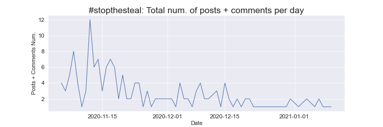

# Milestone 2

## Introduction & Project Goals

The core of our project is to compare several datasets at different times during the US campaign up until the Capitol riots. We want to illustrate how these datasets interact with each other. An example of this is showing the influence of the Trump campaign’s communication (Trump’s speeches, tweets, ...) on the behavior of his parler supporters, and show the influence of Parler users on Trump’s behavior.

From our data analysis, it makes sense to focus and anchor all our visualization on a timeline from January 2020 to January 2021 (Capitol riots). The website will be divided in three main timelines:
* The Campaign:
    * Relationship between Trump’s campaign and Parler users activity and behavior
    * Geolocation of the US: how the Parler activity is increasing
    * Positive sentiment on Parler
* November 3 - Elections & Results
    * From sentimental analysis Parler users start to get negative
* Capitol riots
    * Location of users in Washington DC

## Minimum Viable Website

### Interaction of Trump and Parler

We aim to compare Trump’s behavior and the behavior of his supporters on Parler. We want to visualize the echo chambers of Trump's community, but also the impact of his supporters on his campaign strategy (wording choices echoing Parler discussions etc). For example, we would like to see how the use of certain hashtags based on Trump's statements exploded on Parler after he said them. The figure above illustrates the usage trend of the famous #stopthesteal phrase after the 7th september when Jack Posobiec tweeted “#StopTheSteal 2020 is coming…”. Hence, overall we will visualize histograms of the most frequenty used hashtags/words, as well as how their frequency evolves over time. This section would regroup several visualizations e.g word clouds, graphs showing word/hashtags frquencies, time series, etc.

### Sentiment Analysis

Another one of our goals is to visualize the sentiments of the Parler posts/comments and how they evolve through time as certain political events occur i.e tweets/statements by influential political figures, Capitol Raid etc. We intend to do this as an interactive time series line graph of the sentiments' proportions per day as shown in the figure above and illustrate how the negative sentiment dominates after the Capitol Raid, although the posts were mostly positive befire that. We might also include an alterantive visualzation of the generall overall sentiment scores (between -1 and 1), as opposed to visualizing each sentiment independently.

### Location Data

To show the arrival in Washington, D.C. of some Parler users, we want to show how the distribution of uploads changed between the events of the 6th of January (and maybe a few days before and after, as the rioters stayed for more than one day in the city), and "normal times" before then. Below is an embryo of the future maps, created in Python using Folium, with the 2020 data shown above the 2021 data. We can clearly see that the area surrounding Washington, D.C. was much more active during the first few weeks of 2021, when Parler was still online.

We then want to plot an interactive map, showing where videos were uploaded from on the day of the riots. Having done this visualization in Python, we can clearly see the rioters starting near the Washington Monument in the morning, then gradually moving along the Washington Mall towards the United States Capitol Building, and finally entering it. If possible, we want to give users the possibility to view some videos directly on our website, by clicking on individual data points. This might not be possible, as it won't be easy to host videos somewhere and stream them to the website.

## Tools and Lectures Needed
Our maps will be implemented in D3.js, and we will need lecture 8 on maps. We also use chapter 14, Geomapping, from the "Interactive Data Visualization for the Web" book.

## Extra add-ons for the website
If time permits, we would like to link users to the videos they posted, as we don’t have IDs for Parler posts in the geolocation dataset. This would allow us to determine which users were present at the Capitol riots. We would then analyze the posts made by rioters against the posts made by “normal” users, and see if semantic differences can be found.

Small Parler’s active counter (increasing while scrolling).

## General Architecture of the Website

